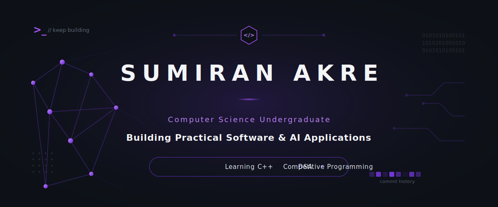
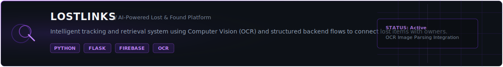
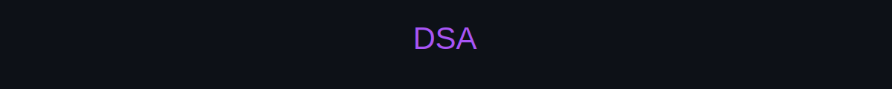
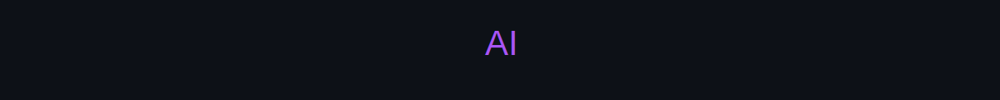
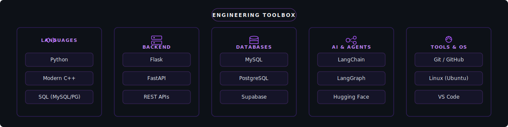
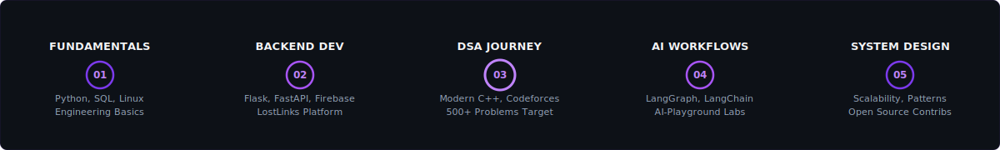

# Building Software ▪️ Solving Problems ▪️ Sharing the Journey.

  

<h2 align="center">Sumiran Akre</h2>

Computer Science Student • Python Backend Developer 
Building Practical Software & AI Applications 
Learning C++ • Data Structures & Algorithms • Competitive Programming

## ◈ Who I Am

I'm a Computer Science student focused on building practical software with Python.
My strongest experience is in backend development—APIs, databases, authentication and deploying applications.
I'm currently strengthening my engineering foundations through Modern C++, DSA and Competitive Programming.

## ◈ Now

- 🚀 Improving **LostLinks**
- 📘 Building **DSA-Journey**
- ⚙️ Learning Modern C++
- 📈 Solving Codeforces problems consistently
- 🤖 Exploring LangGraph & AI workflows

## ◈ Featured Work

 

 

## ◈ Engineering Toolbox

## ◈ Principles

- Build software that solves real problems.
- Understand fundamentals before frameworks.
- Keep learning publicly.
- Improve with every project.

## ◈ Goals & Roadmap (2026)

 

- 📈 Reach Specialist on Codeforces
- 📘 Solve 500+ DSA problems
- ⚙️ Build production-ready backend projects
- 🏛️ Learn System Design
- 🌐 Contribute to Open Source

## ◈ GitHub Activity

  
  

  

  

## ◈ Connect

- **GitHub**: [github.com/SumiRann1](https://github.com/SumiRann1)
- **Codeforces**: [codeforces.com/profile/SumiRann1](https://codeforces.com/profile/SumiRann1)
<!-- **LinkedIn**: *(add your profile)*
- **Email**: *(add your email)*-->

> **Building ▪️ Learning ▪️ Improving ▪️ See you in the next commit.**
