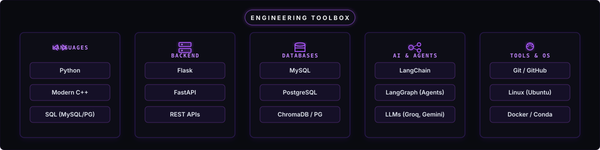
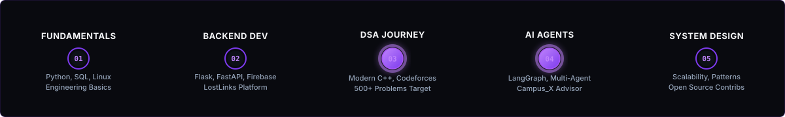

# Building Software ▪️ Solving Problems ▪️ Sharing the Journey.

  

<h2 align="center">Sumiran Akre</h2>

  <strong>Computer Science Undergraduate @ IIT Bhilai • Python Backend &amp; AI Agents Developer</strong>

  I'm a Computer Science student at IIT Bhilai focused on backend engineering and building stateful AI agent workflows. I combine strong foundational knowledge in data structures and algorithms with modern software frameworks to build reliable, data-driven applications. I love solving algorithmic challenges, designing structured APIs, and learning publicly.

  
  
  
  
  

## ◈ Who I Am

- 🏛️ **Academics**: Computer Science student at **IIT Bhilai**, building strong foundations in software engineering and intelligence systems.
- ⚙️ **Backend Engineering**: Designing REST APIs, database schemas, and robust transaction/auth mechanisms with Python.
- 🤖 **AI Agents**: Designing stateful agent workflows, multi-agent frameworks, and structured search routines (JSON/RAG).
- 📈 **Competitive Programming**: Consistently sharpening problem-solving speed and logic with Modern C++ and contest platforms.

## ◈ Now

- 🤖 Refinement of **CAMPUS_X**: Tweaking state validation and planning logic of the academic advisor agent.
- 🚀 Optimizing **LostLinks**: Enhancing OCR extraction pipelines and structured data persistence.
- 📘 Strengthening C++ DSA fundamentals for upcoming Codeforces contests.
- 🌐 Exploring Docker integration and scalable system designs.

## ◈ Featured Work

 

 

 

## ◈ Engineering Toolbox

## ◈ Principles

- **Focus on Fundamentals**: Understand low-level mechanisms and runtime costs before picking abstractions.
- **Fail Gracefully**: Design robust error recovery, guardrails, and validation at every boundary.
- **Build in Public**: Document implementations, logic designs, and milestones.
- **Refactor Constantly**: Treat code quality as an iterative journey toward cleaner structures.

## ◈ Goals & Roadmap (2026)

 

- 📈 Reach **Specialist** ranking on Codeforces.
- 📘 Solve **500+** DSA problems across platforms.
- ⚙️ Develop and host multi-container, production-ready backend platforms.
- 🏛️ Dive deeper into System Design patterns and scalability mechanics.

## ◈ Metrics & Activity

  
  

  
  

  
  

  

## ◈ Connect

  <a href="https://linkedin.com/in/sumiran-credential-placeholder" target="_blank"><strong>LinkedIn</strong></a> ▪️ 
  <a href="mailto:akresumiran@gmail.com"><strong>Email</strong></a> ▪️ 
  <a href="https://codeforces.com/profile/SumiRann1" target="_blank"><strong>Codeforces</strong></a> ▪️ 
  <a href="https://leetcode.com/SumiRann1/" target="_blank"><strong>LeetCode</strong></a>

  

> **Building ▪️ Learning ▪️ Improving ▪️ See you in the next commit.**
